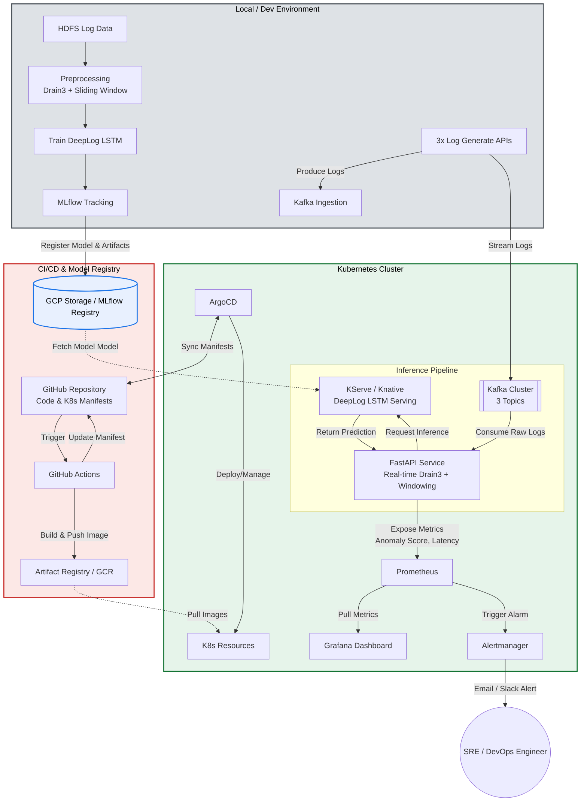

```mermaid
---
config:
  layout: dagre
---
flowchart TB
    classDef local fill:#dee2e6,stroke:#495057,stroke-width:2px,color:#000;
    classDef gcp fill:#e8f0fe,stroke:#1a73e8,stroke-width:2px,color:#000;
    classDef k8s fill:#e6f4ea,stroke:#137333,stroke-width:2px,color:#000;
    classDef ci fill:#fce8e6,stroke:#c5221f,stroke-width:2px,color:#000;
    subgraph LOCAL_DEV [Local / Dev Environment]
        HDFS_Log[HDFS Log Data] --> Preprocess[Preprocessing<br/>Drain3 + Sliding Window]
        Preprocess --> Train[Train DeepLog LSTM]
        Train --> MLflow_Local[MLflow Tracking]
        
        Log_API[3x Log Generate APIs] -->|Produce Logs| K_Ingest[Kafka Ingestion]
    end
    class LOCAL_DEV local;
    subgraph CI_CD [CI/CD & Model Registry]
        MLflow_Local -->|Register Model & Artifacts| GCS[(GCP Storage / MLflow Registry)]
        
        Git_Repo[GitHub Repository<br/>Code & K8s Manifests] -->|Trigger| GH_Actions[GitHub Actions]
        GH_Actions -->|Build & Push Image| GCR[Artifact Registry / GCR]
        GH_Actions -->|Update Manifest| Git_Repo
    end
    class CI_CD ci;
    class GCS gcp;
    subgraph K8S_CLUSTER [Kubernetes Cluster]
        ArgoCD[ArgoCD] <-->|Sync Manifests| Git_Repo
        ArgoCD -->|Deploy/Manage| K8S_Apps[K8s Resources]
        Kafka_K8s[[Kafka Cluster<br/>3 Topics]]
        Log_API -->|Stream Logs| Kafka_K8s
        
        subgraph SERVING_LINE [Inference Pipeline]
            FastAPI_Prep[FastAPI Service<br/>Real-time Drain3 + Windowing]
            KServe[KServe / Knative<br/>DeepLog LSTM Serving]
            
            Kafka_K8s -->|Consume Raw Logs| FastAPI_Prep
            FastAPI_Prep -->|Request Inference| KServe
            KServe -->|Return Prediction| FastAPI_Prep
        end
        Prometheus[Prometheus]
        Grafana[Grafana Dashboard]
        AlertManager[Alertmanager]

        FastAPI_Prep -->|Expose Metrics<br/>Anomaly Score, Latency| Prometheus
        Prometheus -->|Pull Metrics| Grafana
        Prometheus -->|Trigger Alarm| AlertManager
    end
    class K8S_CLUSTER k8s;
    AlertManager -->|Email / Slack Alert| Target_User((SRE / DevOps Engineer))
    GCS -.->|Fetch Model Model| KServe
    GCR -.->|Pull Images| K8S_Apps

```
